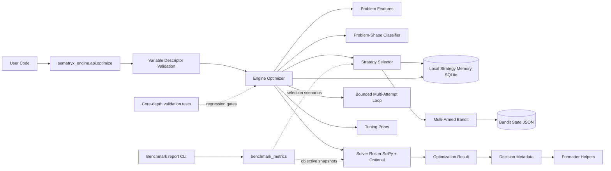

# System Overview

## Product

`sematryx-engine` is a pip-installable local-first optimization engine. It picks a
strategy from a registered roster, runs it (optionally multi-attempt), records the
result in local persistence, and returns a structured result with decision metadata.
No cloud dependencies in the core path; the deprecated sematryx-api codebase is
reference-only (see [`CLAUDE.md`](../../CLAUDE.md) and ADR-0026 / ADR-0027 for
context on the engine vs api relationship).

## Architecture

## Current Substance State

For each named subsystem, the table below lists what the engine actually implements
today. The Engine vs Legacy-API Registry in
[`docs/process/ADOPTION_GATE.md`](../process/ADOPTION_GATE.md) is the canonical
record of port/defer/drop decisions.

| Subsystem | What it is in the engine today | Status |
|---|---|---|
| Problem-shape classifier (`build_problem_shape`) | Deterministic classification from bounds + budget alone — dim count, bound-width statistics, budget-per-dimension. Emits a shape-routing score + directive. **Not a topology pipeline** — see ADR-0026. | substantive (for what it claims) |
| Strategy selector | Filters candidate strategies by problem shape; checks memory override; checks shape-routing override; falls back to bandit pick. | substantive |
| Bandit (`StrategyBandit`) | **Flat** multi-armed Thompson sampling per arm. No context features. Persists alpha/beta state to JSON. | stub (claim "contextual" withdrawn — see registry) |
| Local strategy memory | SQLite store; `get_strategy_recommendations` is a `domain` string equality lookup with optional `descriptor_mix` filter. Problem features are stored but not used for ranking. | partial |
| Solver roster | SciPy methods (`de`, `dual_annealing`, `local_lbfgsb`, `local_powell`, `local_tnc`, `local_slsqp`, `local_cobyla`, `local_nelder_mead`, `local_cg`, `shgo`) + optional non-SciPy backends behind availability checks (CMA-ES, scikit-optimize). | substantive |
| Multi-attempt loop | Fixed fallback chain built upfront from `_attempt_budget` (1–3 attempts based on budget regime). Returns best result. **No adaptation between attempts** — claim "autodidactic" is overstated and tracked in the registry for renaming. | stub (name) / substantive (mechanism) |
| Tuning priors | Hand-picked multiplier dicts indexed by problem complexity, budget regime, and shape-routing directive. `domain_budget_anchor` is an `ord(c)` hash of the domain string in `[0.93, 1.07]` — has no semantic meaning. Verified to help in aggregate (ablation v2: +48% on rugged_multimodal_8d when off). | partial (works in aggregate; some inputs are noise) |
| Decision metadata (`result.explanation`) | Dict of decision inputs + per-attempt records. **Not reasoning** in the LIME/SHAP sense. Formatter helpers print keys; no synthesis. | stub (claim "structured explanation" should be read as "structured trace metadata") |
| Hybrid solver (`solve_hybrid_outer_random_inner_scipy`) | LCB acquisition over discrete shells + neighborhood refinement + inner SciPy per shell. Ablation v2 verified: refinement is load-bearing. | substantive |
| Variable descriptors | Continuous / integer / categorical typed descriptors at API entry. Validated, routed to appropriate solver. | substantive |
| Benchmark metrics | Selection scenarios (cold/warm hit-rate + confidence) and objective snapshots (sphere + discrete validation). No "learning quality trend" — single-shot snapshots. | partial (claim "trend report" overstated) |
| Ablation harness | `make ablation` runs (scenarios × knobs × seeds) matrix; emits JSON + Markdown with Mann-Whitney U verdicts per (scenario, knob). Verdict rule: direction + significance only. | substantive |

## Boundaries

- **Local-first runtime:** no required cloud dependencies in the core path. Optional
  integrations are isolated behind explicit adapters and disabled by default.
  Enforced by `scripts/check_forbidden_imports.py`.
- **Strategy memory and bandit state are persisted locally** under `~/.sematryx/`.
  Discrete/hybrid runs record descriptor-shape features and bandit reward metadata
  in the SQLite `features_json` blob (these are *stored*; the selector does not
  currently use them for ranking).
- **Reported selection confidence** reflects either the bandit's posterior mean or an
  evidence-scaled memory override (`memory_override_confidence(usage_count)`).
- **Offline benchmark snapshots** use `benchmark_metrics` and the report CLI without
  affecting live optimize paths. Snapshots are single-shot, not time-series.
- **Problem-shape classifier** emits a deterministic shape-routing score + directive
  from bounds and budget. When the score crosses 0.75 or directive is `aggressive`,
  the selector's shape-routing override forces `scipy_dual_annealing`. This is
  **not** a topology pipeline — the real topology pipeline (Sobol decomposition +
  Physarum network mapping + topology-informed tunneling) is Stage 4 Slice 1 work
  (see ADR-0026, ADR-0027, and the registry).
- **Mixed hybrid runs** use LCB acquisition over discrete shells (random + incumbent
  neighbors), then sorted-neighbor refinement (inner SciPy per shell), with
  deduplicated discrete assignments. Hybrid inner continuous strategy selection may
  consult SQLite memory scoped by `descriptor_mix`.
- **Bounds-only continuous runs** exclude discrete/hybrid strategy IDs from bandit
  selection so routing stays compatible with `solve_with_strategy`.
- **Core-depth validation tests** gate benchmark thresholds and runtime contract
  parity fields against the registered surfaces.

## Audit history

- 2026-05-13 — ADR-0026: topology pipeline drift discovered and corrected (rename
  `topology_artifact` → `problem_shape`, `physarum_tunneling_score` →
  `shape_routing_score`, etc.). Real topology pipeline scoped as Stage 4 Slice 1.
- 2026-05-13 — ADR-0027: broader substance audit. Registry created; substance gate
  added to `scripts/check_policy.py`; VR Substance Audit section made mandatory.
