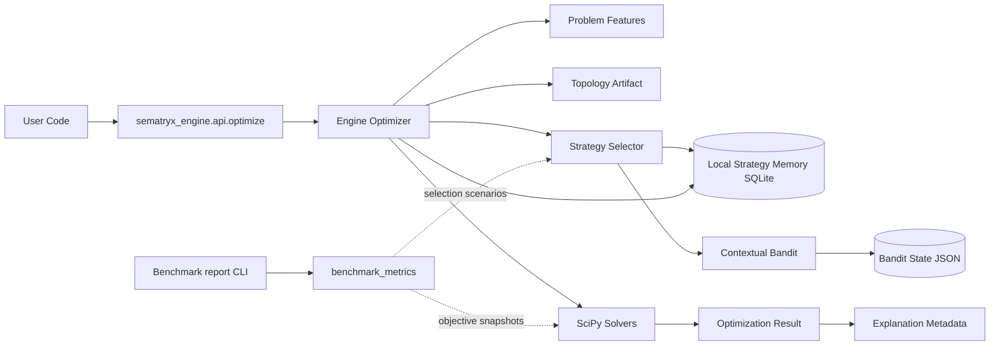

# System Overview

## Boundaries

- Local-first runtime: no required cloud dependencies in core path.
- Strategy memory and learning are persisted locally.
- Integrations beyond local runtime must be optional adapters.
- Reported selection confidence reflects posterior belief or evidence-scaled memory override.
- Offline benchmark snapshots use `benchmark_metrics` and the report CLI without affecting live optimize paths.
- Snapshot version 2 adds reproducible objective-quality rows (isolated memory/bandit paths + scipy solve).
- Stage 4 kickoff adds a deterministic topology artifact to each result without changing routing yet.
