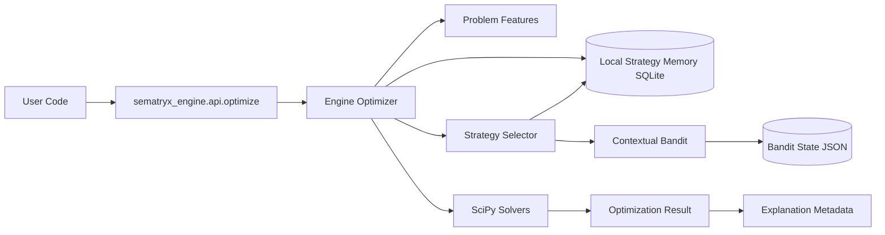

# System Overview

## Boundaries

- Local-first runtime: no required cloud dependencies in core path.
- Strategy memory and learning are persisted locally.
- Integrations beyond local runtime must be optional adapters.
